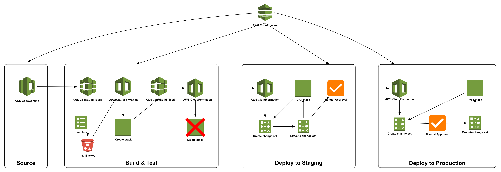
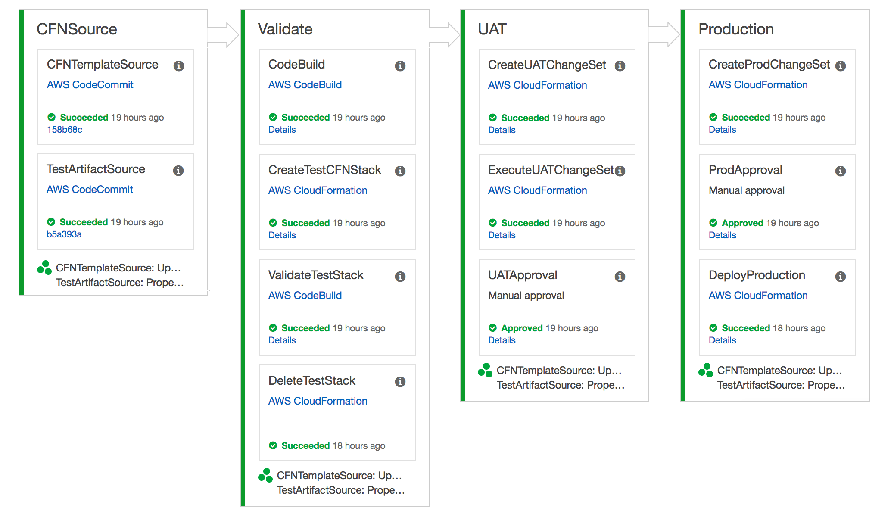

# CodePipeline-Nested-CFN

This repo contains the CloudFormtaion template which will create a CodePipeline containing multiple stages starting from CodeCommit as source stage, followed by build using CodeBuild, launch test stack, test using CodeBuild, proceed with UAT deployment and wait for manual approval. Once approved it proceed to production stage where it creates a CloudFormation ChangeSet for production stack and wait for approval, once approved it will execute the ChangeSet in production stack.



Let's start by creating the repositories and enabling Continuous Delivery pipeline for nested CFN.

## Step 1:

### Create base VPC Stack
In the [cfn-nested-repo](cfn-nested-repo/) directory there are multiple YAML (*CloudFormation Templates*) & JSON (*CloudFormation Configuration*) files.

**[vpc-stack.yml](cfn-nested-repo/vpc-stack.yml):** is the CloudFormation template to create the base VPC, Subnets, NAT Gateways, etc which will be used.
**[vpc-params.json](cfn-nested-repo/vpc-params.json):** is the parameters file which contains the parameter values for the CFN template. Update the *ProdApprovalEmail & UATApprovalEmail* values to provide the appropriate email address.

Go to `cfn-nested-repo` directory and execute the following AWS CLI command to create CloudFormation stack.

```bash
cd cfn-nested-repo
aws cloudformation create-stack --stack-name NestedCFN-BaseStack --template-body file://vpc-stack.yml --parameters file://vpc-params.json
```

## Step 2:

### Update CloudFormation parameters configuration files
In the [cfn-nested-repo](cfn-nested-repo/) directory there are following 3 JSON (*CloudFormation Configuration*) files.

**[config-test.json](cfn-nested-repo/config-test.json):** - CloudFormation parameter configuration file for test stack
**[config-uat.json](cfn-nested-repo/config-uat.json):** - CloudFormation parameter configuration file for UAT stack
**[config-prod.json](cfn-nested-repo/config-prod.json):** - CloudFormation parameter configuration file for Prod stack

Update these 3 configuration files with appropriate values for *VPCID, PrivateSubnet1, PrivateSubnet2, PublicSubnet1, PublicSubnet2, S3BucketName & DBSubnetGroup* based on the values in the output section of the base VPC stack created in Step 1. Update *KeyPair* value with an existing key pair or create a new key pair and use it.

## Step 3:

### Creating CodeCommit repositories
Create two CodeCommit repositories as mentioned below.

```bash
aws codecommit create-repository --repository-name cfn-nested-repo --repository-description "Repository for CloudFormation templates"

aws codecommit create-repository --repository-name validate-resources --repository-description "Repository for unit testing CloudFormation resources"
```

Once the repositories are create, clone those repositories and upload the content of directories `cfn-nested-repo` & `validate-resources` in their corresponding repositories.

## Step 4:

### Creating CodePipeline using CloudFormation

Update the **[codepipeline-cfn-codebuild.json](codepipeline-cfn-codebuild.json)** file with the appropriate values for *ArtifactStoreS3Location, UATTopic & ProdTopic* based on the values from output section of main stack created in Step 1 and update the values for *CFNTemplateRepoName & ValidateResourcesRepoName* with appropriate values based on the repositories created in Step 3.

Once the configuration file has been updated, execute the following command to create the CloudFormation stack which will create the required CodePipeline.

```bash
aws cloudformation create-stack --stack-name NestedCFN-CodePipeline --template-body file://codepipeline-cfn-codebuild.yml --parameters file://codepipeline-cfn-codebuild.json --capabilities CAPABILITY_NAMED_IAM
```

Once the CloudFormation successfully creates the stack, it would have created a CodePipeline with similar stages as shown below.



_Note: While removing the resources, delete the Prod & UAT stacks created by pipeline before deleting the pipeline since those CloudFormations stacks uses the role created by pipeline stack._
